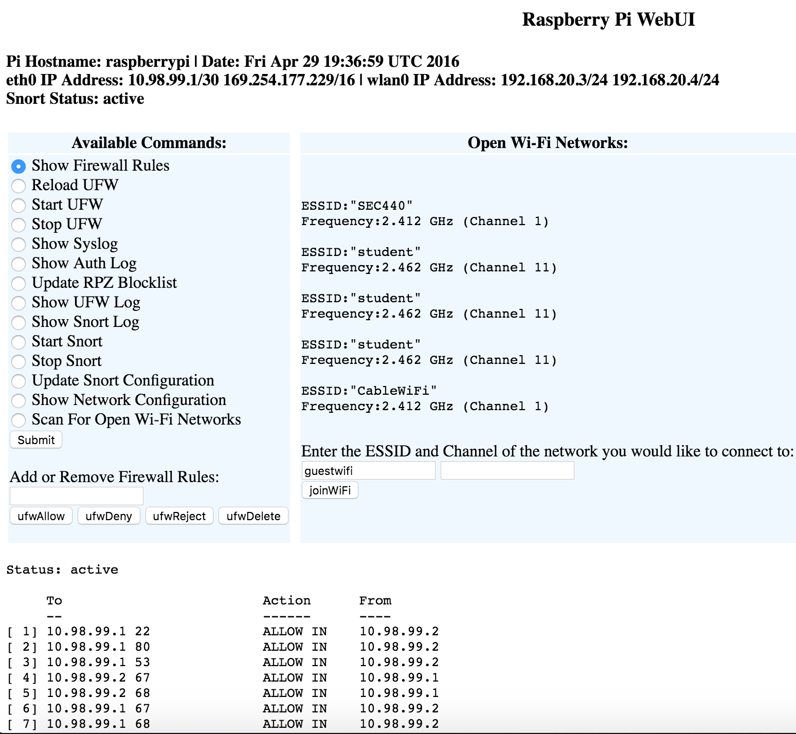

## RpiFw

Raspberry Pi firewall for our SEC440 final project at Champlain College

## Usage

- Setup BIND9, Snort, DHCP and Apache2
- `/usr/lib/cgi-bin/console.sh` is the primary webpage
- Run scripts in `/root` in order to prepare your Pi upon boot
- Use `atBoot.sh` after the intial setup
- See instructions.txt for some additional notes 

## Screenshot

## Credits

- Ethan Farmer - [@efarm3r](https://twitter.com/efarm3r)

- Tyler Boire - [@md5hashtag](https://twitter.com/md5hashtag)

